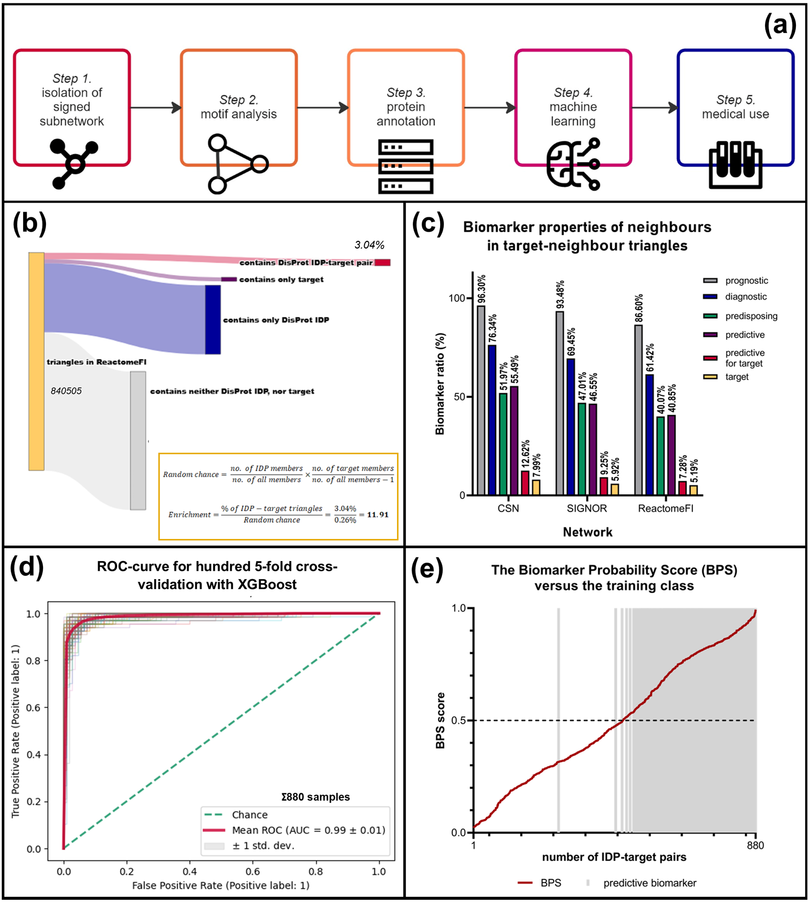

---

# Overview of the MarkerPredict Project



**Figure 1.** A step-by-step approach to the network-topology-based identification of predictive oncotherapeutical biomarkers.

(a) A 5-step flowchart of the MarkerPredict (previously named as IDPredict) process. In the first two steps, the network topology analysis process is detailed. After the identification of IDP-target pairs, the next step is protein annotation to establish the final input dataset. Then, machine learning models are trained, and the classification of the unlabelled data is carried out. As a final step, the predicted predictive biomarkers are reviewed with the scope of potential medical usage.

(b) Step 1–2: Sankey diagram of the identified triangles in the ReactomeFI37 network. 3.04–1.64% of the triangles contained DisProt-defined IDPs or targets. Based on the number of DisProt IDP and target members in triangles, the random chance for IDP-target triangles can be calculated. Comparing this value with the actual ratios, IDP-target triangles are overrepresented in every network. The DisProt enrichment ratio is 118.931 in ReactomeFI (highlighted), 5.66–6.36 in CSN35, and 4.861 in the SIGNOR36 network. For AlphaFold IDPs (defined as pLLDT<50), it is 5.48, 6, and 1.7; for IUPred long score > 0.5 it is 6.1, 5.88, and 3.74; and for short score > 0.5 it is 3.98, 7.41, and 3, respectively.

(c) Step 3: The biomarker properties of IDP neighbours of target members in IDP-target triangles including cancer drug targets. The majority of IDP neighbours (86.7–96.37%) were considered biomarkers according to the CIViCmine database. Among predictive biomarker IDP neighbours, a considerable ratio is established as a predictive biomarker of a drug which has its target in a shared triangle with the particular IDP.

(d) Step 4: Receiver operating characteristic (ROC) curve of 100× 5-fold cross-validation with the XGBoost model trained on the combined data of CSN, SIGNOR, and ReactomeFI networks using all 3 IDP databases. The model reached high performance, with the average area under the curve (AUC) of 0.996 ± 0.031 (marked in red). Other validation models also showed high performance (see Supplementary Table S3).

(e) Step 5: The Biomarker Probability Score (BPS), a rank score calculated from prediction probabilities (definition in Figure 2) versus the original label of the training dataset. This figure shows the BPS score calculated with models trained on all 3 IDP databases. In order of increasing BPS (marked in red), the original labels are shown with grey shading. A strong correlation is visible, with a few differing labels near average BPS values.


# The Scripts and Files of the MarkerPredict Package

## Input Files

### *- full_input_dataset.xlsx:*

Contains all the protein annotations under the *all_prots* tab. Contains all the annotated neighbour-target pairs under the *all_pairs* tab and the simplified version under the *all_pairs_ML* tab.

### *- all_pairs.csv:*

The *.csv* converted version of *all_pairs_ML*. Contains all the annotated neighbour-target pairs, and is the input file of every Jupyter Notebook in the package. The train and test sets are created by filtering this file for the appriate database- and network-specific model. Positive control sets are considered when a neighbour is a biomarker for its target pairs, and negative control sets are created from proteins not present in the CIViCmine database, with additional random pairs for the DisProt model. The model can be run with different input data structured in the same way.

## Scripts of the 70:30 train:test split

These scripts prepare the positive and negative control sets, then split them in a 70:30 ratio to train then test database- and network-specific Random Forest and XGBoost models. These files also have the option to use randomly selected negative control pairs. The outputs are ROC curves, PR curves and metric heatmaps.
There is a separate script for each IDP database and for a combined prediction:
- predictive_biomarker_ML_70_30.ipynb
- predictive_biomarker_ML_70_30_DisProt.ipynb
- predictive_biomarker_ML_70_30_AlphaFold.ipynb
- predictive_biomarker_ML_70_30_IUPred.ipynb

## Scripts of 10-fold crossvalidation and LOOCV

These scripts prepare the positive and negative control sets, then do both 10-fold crossvalidation and leave-one-out-cross-validation (LOOCV) on them. The outputs are integrated ROC curves, LOOCV visualisations, metrics heatmaps and probability values for every pair being predicted in LOOCV.
There is a separate script for each IDP database and for a combined prediction:
- predictive_biomarker_ML_LOOCV.ipynb
- predictive_biomarker_ML_LOOCV_DisProt.ipynb
- predictive_biomarker_ML_LOOCV_AlphaFold.ipynb
- predictive_biomarker_ML_LOOCV_IUPred.ipynb

## Scripts of network crosstraining

These scripts train on one network to test on another to check the inter-applicability of the method. The *only_topology* scripts only use network topological annotations as input data. The outputs are metric heatmaps.
There is a separate script for each IDP database and for a combined prediction:
- network_cross_training.ipynb
- network_cross_training_DisProt.ipynb
- network_cross_training_AlphaFold.ipynb
- network_cross_training_IUPred.ipynb
- network_cross_training_only_topology.ipynb
- network_cross_training_only_topology_DisProt.ipynb
- network_cross_training_only_topology_AlphaFold.ipynb
- network_cross_training_only_topology_IUPred.ipynb

## A script of factor separation

This script separates the input features to subgroups, then conducts LOOCV analysis on each subgroup. The output is a heatmap of accuracy values.
As IDP probabilities are only part of one subgroup, this analysis was run on the data of all databases and without separate analysis:
- separating_factors.ipynb

## Scripts of SHAP analysis

These scripts perform a game theory Shapley-score calculation for each input parameter to assess the feature importance. The outputs are feature importance graphs showing the top important features. In the case of the XGBoost model, they also show the feature values' effect on prediction outcome.
There is a separate script for each IDP database and for a combined prediction:
- SHAP.ipynb
- SHAP_DisProt.ipynb
- SHAP_AlphaFold.ipynb
- SHAP_IUPred.ipynb

## Scripts of final predictive biomarker classification

These scripts prepare the positive and negative control sets, then train combined and network- and database-specific models on them. Then, these models predict labels and label probability of the unlabeled data, which later can be used for Biomarker Probability Score (BPS) calculation. 
There is a separate script for each IDP database and for a combined prediction:
- predictive_biomarker_final_classification.ipynb
- predictive_biomarker_final_classification_DisProt.ipynb
- predictive_biomarker_final_classification_AlphaFold.ipynb
- predictive_biomarker_final_classification_IUPred.ipynb

## Biomarker Probability Score (BPS) Values and Template

### *- BPS_score_calculation.xlsx:*

This spreadsheet contains the probability values and BPS calculation for each IDP database and the combined data. The score is the normalised average ranking of the probability values. On the last tab, the four BPS values are averaged and compared with each other. This spreadsheet can be used as a template to calculate BPS scores from new predictions.


# Project Setup and Troubleshooting

## Introduction

To run the codes in this project, we created a .toml file, so creating virtual environments and installing dependencies is possible with the Poetry Python package.
This document outlines the steps taken to set up and troubleshoot Poetry with Python, focusing on resolving issues related to virtual environments and Python version compatibility.

## Steps to Set Up and Troubleshoot Poetry

### 1. Verify Python Installation

Ensure that Python 3.9 is correctly installed and accessible:

```powershell
C:\Users\YourUsername\AppData\Local\Programs\Python\Python39-32\python.exe --version
```

This should output Python 3.9.x. If it fails, reinstall Python 3.9.

### 2. Reconfigure Poetry to Use Python 3.9

1. **Remove Existing Virtual Environment**

   ```powershell
   poetry env remove python
   ```

2. **Set Python Version for Poetry**

   ```powershell
   poetry env use C:\Users\YourUsername\AppData\Local\Programs\Python\Python39-32\python.exe
   ```

3. **Reinstall Dependencies**

   If using `poetry install` is not preferred, skip this step. 

### 3. Manually Create and Manage Virtual Environment (If Needed)

1. **Create Virtual Environment**

   ```powershell
   C:\Users\YourUsername\AppData\Local\Programs\Python\Python39-32\python.exe -m venv myenv
   ```

2. **Activate Virtual Environment**

   ```powershell
   .\myenv\Scripts\activate
   ```

3. **Install Poetry in the Virtual Environment**

   ```powershell
   pip install poetry
   ```

4. **Initialize Poetry**

   Navigate to your project directory and run:

   ```powershell
   poetry init
   ```

5. **Add Dependencies**

   Manually add dependencies as needed:

   ```powershell
   poetry add <dependency>
   ```

### 4. Run Jupyter Notebook (If Required)

1. **Add Jupyter Notebook**

   ```powershell
   poetry add jupyter
   ```

2. **Run Jupyter Notebook**

   ```powershell
   poetry run jupyter notebook
   ```

### 5. Troubleshooting Common Issues

1. **Python Executable Issues**

   Verify that the correct Python executable is being used and is functional.

2. **Virtual Environment Errors**

   Ensure that old or conflicting virtual environments are removed.

3. **Configuration Issues**

   Check and reset Poetry’s configuration:

   ```powershell
   poetry config --list
   poetry config --unset virtualenvs.prefer-active-python
   ```

4. **Permissions Errors**

   Run PowerShell or Command Prompt as an Administrator if facing permission issues.

## Summary

- **Verify Python Installation**.
- **Reconfigure Poetry and Set Python Version**.
- **Manually Create and Manage Virtual Environment** if needed.
- **Run Jupyter Notebook** and troubleshoot common issues.

For further assistance, refer to Poetry and Python documentation or seek help from relevant forums.

---

Replace `YourUsername` with your actual Windows username in the file.
